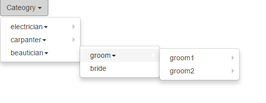

# Dynamic-Dropdown

Creates a dynamic drop down menu in PHP using a categories table in a mySQL database. 

# Setup

- Import the sql dump from `dynamic-dropdown/sql-dump.sql` into a mySQL database. 
- Run `composer install` 
- Copy `conn.example.php` as `conn.php` and update your mysql connection settings. 
- Use any web server with PHP support to load the index.php file and you can see the drop down menu working.

